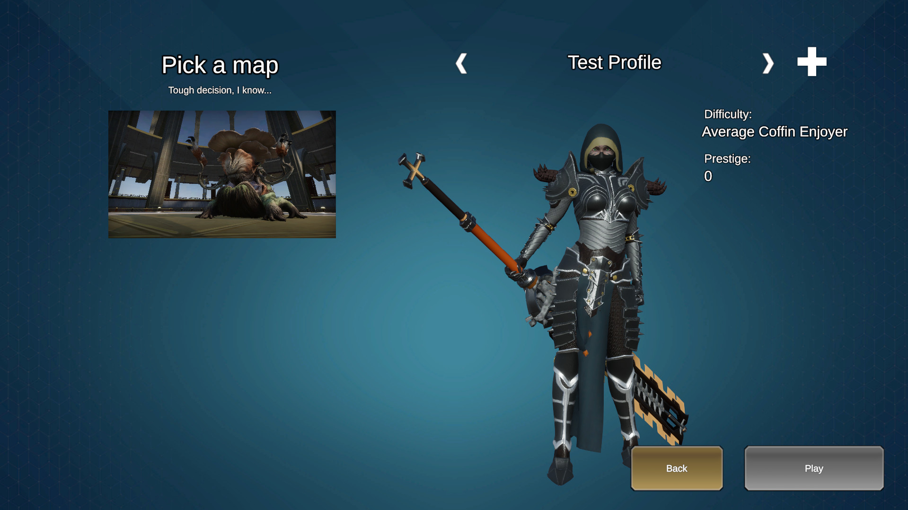
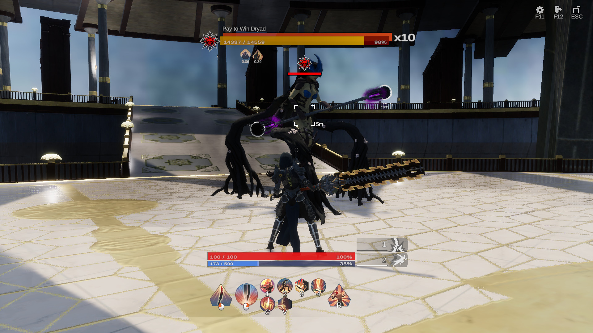
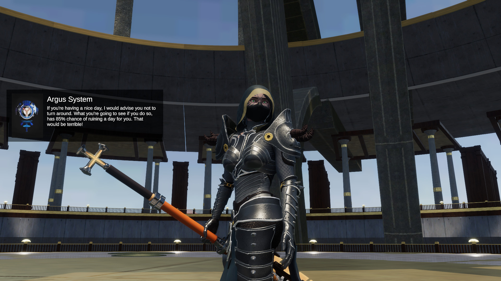

# Skyforge Unity Remake
## The game that once made us Immortal, now needs to be resurrected.

This game will be aimed at people who miss the original Skyforge. The combat system, the character classes, the worldbuilding and the climate of the original game will be slowly re-created, as the development progresses. For now, it’s just a short presentation of a game, with one quickly assembled Divine Observatory map, remade as a short dungeon, some key systems already implemented, and the fully finished Berserker class to try out.

There are plenty of in-game systems already working, such as the whole combat system, perk-unlocking system, cutscene system or player profiles. Half of the Pythonides faction is implemented, with Dione basic enemy, Dryad boss and Entid boss, summoning healing Triffids. The Divine Observatory Test Dungeon is fully playable, although the map itself, design-wise was assembled in a hurry, just to have a place to test things out. Fully visually designed maps will appear in the future, once all the desired systems are ready.

Current main goal is to reintroduce the Ascension Atlas. It’s mechanics will more resemble the one from the initial version of the game, from before the Ascension Update, but with some differences. Excluding the inventory, the only source of character’s power will be Atlas itself, each node improving only one type of stat on unlock. This way, the player would choose what stat they would like to improve, within the Atlas path they choose. In the Character Atlas, there will also be special nodes that would unlock some functionalities previously available in all kinds of stores, monoliths, quests, etc. The special nodes will feature for example companion abilities, functional symbols and unlocking new classes. There will be two separate versions of the Atlas. One for the character, and one for the class. The class one will be available once a specific class is unlocked in the Character Atlas. All the unlocked nodes in the Class Atlas will give new abilities (replacing the class quest system), improve stats (only on that specific class, meaning, if someone has a max HP node on Grovewalker Atlas, it won’t work when the player switches to Gunner), and also unlock Class-specific nodes like Terra nodes.

The game contains assets that imitate the originals, but it does not include any original asset from Skyforge.

## Getting Started

Requirements:
Unity 6000.3.18f1 - recommended version

Steps:
1. Clone this repository.
2. Open UnityHub
3. Go to Projects -> Add -> Add project from disk
4. Choode the path to the downloaded repository
5. Open the project and wait until all the packages are installed

## Current focus

Here are the things that are worked on, or will be in the near future:

- [ ] In-game menu that would resemble one from the original game
- [ ] Ascension Atlas
- [ ] Equipment System
- [ ] Character customization
- [ ] Character facial animations and idle animation variation
- [ ] Extended non-combat functionalities like interacting with objects or jumping
- [ ] Skipping cutscenes
- [ ] Second map with new types of enemies and bosses 
- [ ] Dungeon finish screen, with rewards, statistics etc.

## License

The source code of this project is licensed under the MIT License.

See [LICENSE](LICENSE).
