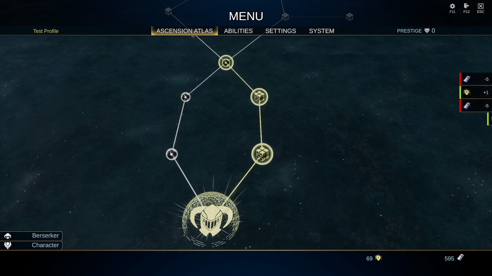

# Skyforge Unity Remake
## The game that once made us Immortal, now needs to be resurrected.

This game will be aimed at people who miss the original Skyforge. The combat system, the character classes, the worldbuilding and the climate of the original game will be slowly re-created, as the development progresses. For now, it’s just a short presentation of a game, with one quickly assembled Divine Observatory map, remade as a short dungeon, some key systems already implemented, and the fully finished Berserker class to try out.

There are plenty of in-game systems already working, such as the whole combat system, Ascension Atlas, cutscene system or player profiles. Half of the Pythonides faction is implemented, with Dione basic enemy, Dryad boss and Entid boss, summoning healing Triffids. The Divine Observatory Test Dungeon is fully playable, although the map itself, design-wise was assembled in a hurry, just to have a place to test things out. Fully visually designed maps will appear in the future, once all the desired systems are ready.

The Ascension Atlas prototype that is already implemented strongly resembles the first version of the atlas, first for the character, where all the classes and symbols are unlocked and casual stats are improved. Once the class is unlocked, the second atlas appears, with class abilities and class-specific symbols to unlock. There are also basic stat nodes in the class atlas, but they will work only while the player uses this specific class. Naturally, more bulky stats like HP and Defense will appear in tank class atlases, more DPS nodes like attack speed and damage will appear in the DPS ones etc. This way, classes will not be automatically better in their field of expertise, but rather will have a bigger upgrade potential, and will become better over time. This approach gives as much freedom and room to experiment as the original atlas system, from before the infamous Ascension Update.

There is a resource needed to unlock the atlas nodes, called Eidos, inspired by the invasion Eidoses from later versions of the game. For now, there’s just one type of those, but in the future, many types will be added. Specific nodes will require their specific type of Eidoses, so that the player would have to prioritize a certain types of missions/enemies in order to quickly progress. For now, Aelion Eidoses are available to purchase in the vending machine close to the player’s spawn point in the Divine Observatory for as little as 5 Credits each. Player profile will have 1000 Credits, meaning 200 Eidoses in total, which is not enough to unlock full Atlas, so pick what suits you the most. This will change when a proper reward system is implemented.

The next milestone is the equipment system. As the game aims to be single-player, all kinds of oppressive MMO mechanics made to squeeze the real money from players will be removed. Item classification to common/rare/mythical/legendary will persist, but in a different form. Also, some kind of simple crafting and equipment upgrades will be added, replacing the original’s “Pay money and re-roll to make the jewel strong” system. What will be different to the original game, the functional armor will be introduced. There will be option to customize the character appearance regardless of armor they wear, but in order to unlock a specific armor in the style room, said armor would have to be acquired by the player first. Armor will be the second most important piece of equipment (after the weapon), with some armors having specific unique bonuses other than stat-improvements.

During adventures, there will be chests to find (sometimes with guards), with a separate loot, adequate to the dungeon’s level. The player would also have an option to unload their bag with a kind of external storage located likely in their headquarters.

The game contains assets that imitate the originals, but it does not include any original asset from Skyforge.

## Getting Started

Requirements:
Unity 6000.3.18f1 - recommended version

Steps:
1. Clone this repository.
2. Open UnityHub
3. Go to Projects -> Add -> Add project from disk
4. Choose the path to the downloaded repository
5. Open the project and wait until all the packages are installed

## Current focus

Here are the things that are worked on, or will be in the near future:

- [x] In-game menu that would resemble one from the original game
- [x] Ascension Atlas
- [ ] Equipment System
- [ ] Character customization
- [ ] Character facial animations and idle animation variation
- [ ] Extended non-combat functionalities like interacting with objects or jumping
- [ ] Skipping cutscenes
- [ ] Second map with new types of enemies and bosses 
- [ ] Dungeon finish screen, with rewards, statistics etc.

## License

The source code of this project is licensed under the MIT License.

See [LICENSE](LICENSE).
